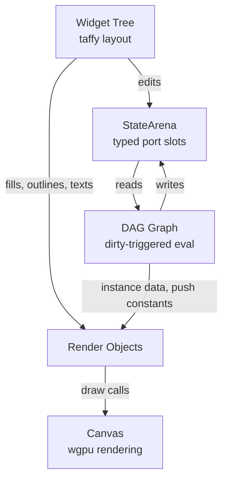

# shame-gui

A 2D immediate-mode GUI framework for [wgpu](https://github.com/gfx-rs/wgpu), built on the **[shame](https://github.com/anomalyco/shame)** Rust EDSL. GPU shaders are written in native Rust — no WGSL, no GLSL.

[Exaple App: Calcuator](crates/shame-gui/examples/calc.rs)

> Early Stage: API Changes All The Time.

## Core ideas

### 1. State is the single source of truth

Your application state is a plain Rust struct. `#[derive(DagStruct, Widget)]` on it generates everything needed to both **render editable widgets** for it and **flow it through a DAG** for computation and GPU rendering. The same arena slots are shared between the GUI and the DAG — no sync code, no glue, no duplication.

### 2. Shaders are Rust functions

Custom GPU materials use the **shame** EDSL. You write a `Material::build()` method that constructs a render pipeline using native Rust syntax. Shame traces the computation into WGSL under the hood, so you get type-checked, composable shader code without leaving Rust.

```rust
impl Material for MyMaterial {
    type Instance = MyInstance;
    type PushConstant = MyParams;

    fn build(&self, gpu: &sm::Gpu) -> PipelineData {
        // Write GPU-side logic here with sm::vec!, sm::Array, etc.
    }
}
```

Many functions — like `pixel_to_ndc` and `rect_to_ndc` — compile to **both** CPU and GPU via a `const GPU: bool` generic. Write the math once, use it on both sides.

### 3. DAG-driven architecture

All logic and rendering flows through a **dependency-acyclic graph**. Nodes read from input ports, compute, and write to output ports. The framework marks ports dirty on change; only the affected nodes re-evaluate. This handles:

- **App logic** — like the calculator above.
- **Render ports** — feed `Vec<RectEntry>`, `Vec<TextObject>` into built-in fast-path draw calls.
- **Custom render objects** — wire arena ports into GPU buffers and bind groups, then into draw calls, via `App::register_render_object`.

### 4. ViewportRect bridges layout and GPU

`ViewportRect` is a passive, invisible widget that captures the pixel-space rectangle assigned to it by the layout engine. Wire its ports into a DAG node that converts to NDC, feed the result as a push constant to a custom material, and you get **viewport-tracked GPU rendering** — shaders that draw exactly where the layout told them to.

## Examples

Each example teaches one concept:

| Example | Concept |
|---|---|
| `calc` | DagStruct + Widget derive, build_state_ports, state→DAG→GUI |
| `form` | into_viewport_nodes, into_tab_nodes, split/tab/container nesting |
| `rects` | Fast-path fills & outlines, custom gradient material |
| `text` | TextObject, wrap width, z-ordering |
| `blend` | Transparent materials, blend mode |
| `push_constant` | Source ports (`elapsed`), time-varying push constants, precision |
| `custom_widget_rendering` | ViewportRect + state-driven DAG + custom material end-to-end |

```
cargo run -p shame-gui --example calc
cargo run -p shame-gui --example push_constant
```

## Architecture



- **StateArena** — typed slot storage. Values live at `PortId`s; multiple `Port<T>` handles can share the same slot. No deletion, no fragmentation.
- **DAG** — nodes declare inputs and outputs as port IDs. First tick runs every node; subsequent ticks run only nodes whose inputs are dirty.
- **Widget tree** — built from `ViewportNode` variants (`Widget`, `Split`, `Tab`, `Container`). Layout uses taffy for containers, pixel arithmetic for splits and tabs.
- **Canvas** — one pipeline per material, one draw call per render-object registration. Depth-testing with `less_equal` handles z-ordering.
- **Snapshot tests** — pixel-exact GPU comparisons against golden images. Each scene is its own test binary (winit `EventLoop` limitation).

## Design decisions

- **Panic-fast** — no `Result`/`Error`. Unwrap and expect everywhere.
- **Physical pixels, y-down** — all coordinates are physical pixels with origin at top-left. `Rect::to_ndc(fb_size)` is the only NDC conversion point.
- **Smaller z = closer** — `Depth24Plus` with `less_equal`. Shared across rect and text passes.
